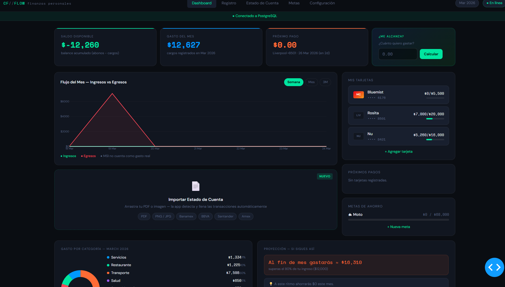

# CF//FLOW — Finanzas Personales

Aplicación web para el seguimiento de gastos personales, tarjetas de crédito y metas de ahorro. Construida con Python, Dash y PostgreSQL, empaquetada en Docker.
---



## Tecnologías

- **Python 3.11** — lógica de negocio y servidor
- **Dash / Plotly** — UI reactiva y gráficas
- **dash-bootstrap-components (DARKLY)** — componentes de formulario y grid
- **SQLAlchemy** — ORM, modelos y migraciones implícitas via `create_all`
- **PostgreSQL 15** — base de datos
- **Docker + docker-compose** — entorno reproducible

---

## Estructura del proyecto

```
cash_flow/
├── app.py                        # Entry point: layout raíz, nav, routing
├── assets/
│   └── style.css                 # Tema oscuro completo (variables CSS --cf-*)
├── app/
│   ├── dash_app.py               # Instancia Dash compartida (importada por todos los módulos)
│   ├── db/
│   │   ├── models.py             # Modelos SQLAlchemy
│   │   └── session.py            # Engine, SessionLocal, init_db, check_connection
│   ├── pages/
│   │   ├── dashboard/            # Vista principal con KPIs, gráficas y tabla
│   │   ├── registro/             # Formulario para registrar transacciones
│   │   ├── estado_de_cuenta/     # Historial filtrable por mes, año y tipo
│   │   ├── metas/                # Gestión de metas de ahorro (CRUD)
│   │   └── configuracion/        # Alta de tarjetas y perfil financiero
│   └── pipeline/                 # Reservado para extracción IA (Anthropic)
├── docker-compose.yml
├── Dockerfile
└── requirements.txt
```

Cada directorio en `pages/` contiene exactamente dos archivos:
- `layout.py` — define la estructura HTML/componentes de la vista
- `callbacks.py` — define todos los callbacks de Dash para esa vista

---

## Modelos de datos

| Modelo | Descripción |
|---|---|
| `Tarjeta` | Banco, alias, terminación, día de corte, días para pago, límite de crédito |
| `Categoria` | Categorías de gasto (nombre único) |
| `Transaccion` | Cargo o abono asociado a una tarjeta y categoría, soporta MSI |
| `ParcialidadMSI` | Parcialidades mensuales generadas al registrar una compra a MSI |
| `PerfilFinanciero` | Singleton (id=1) con el ingreso mensual del usuario |
| `MetaAhorro` | Metas de ahorro con monto objetivo, monto actual y color de progreso |

---

## Arquitectura de la UI

Dash es un framework reactivo: el servidor Python genera el HTML inicial y los callbacks actualizan partes del DOM sin recargar la página. El flujo es:

1. `app.py` crea el layout raíz con un `html.Nav` personalizado y un `html.Div(id="page-content")` vacío.
2. El usuario hace clic en una pestaña del nav. Esto dispara el callback `switch_tab`, que actualiza el `dcc.Store(id="active-tab")` con el identificador de la página activa.
3. El callback `render_page` escucha ese Store y devuelve el layout correspondiente como contenido de `page-content`.
4. Al renderizarse el nuevo layout, los callbacks de esa página (que tienen `suppress_callback_exceptions=True`) se disparan con sus inputs iniciales y populan los datos desde PostgreSQL.

### Bus de refresco

Para sincronizar múltiples vistas ante cambios en la base de datos se usan tres Stores encadenados:

- `store-tx-trigger` — incrementado al guardar una transacción
- `store-cfg-trigger` — incrementado al guardar una tarjeta o perfil
- `store-refresh` — recibe la suma de los dos anteriores via `merge_refresh`

Los callbacks de lectura (KPIs, tabla, gráficas) escuchan `store-refresh` como input, garantizando que cualquier escritura refresque todas las vistas activas.

### Prefijos de IDs

Para evitar conflictos de IDs entre páginas (Dash requiere IDs únicos globales) cada página usa un prefijo distinto: `d-` (dashboard), `r-` (registro), `ec-` (estado de cuenta), `m-` (metas), `c-` (configuración).

---

## Variables de entorno

| Variable | Valor por defecto (Docker) |
|---|---|
| `DATABASE_URL` | `postgresql://cashflow:cashflow@db:5432/cashflow_db` |
| `DEBUG` | `true` |
| `ANTHROPIC_API_KEY` | _(requerido para pipeline IA)_ |

---

## Levantar en local

```bash
docker-compose up --build
```

La app queda disponible en `http://localhost:8050`.

Para desarrollo sin Docker, requiere una instancia de PostgreSQL accesible y `DATABASE_URL` configurado en `.env`.
